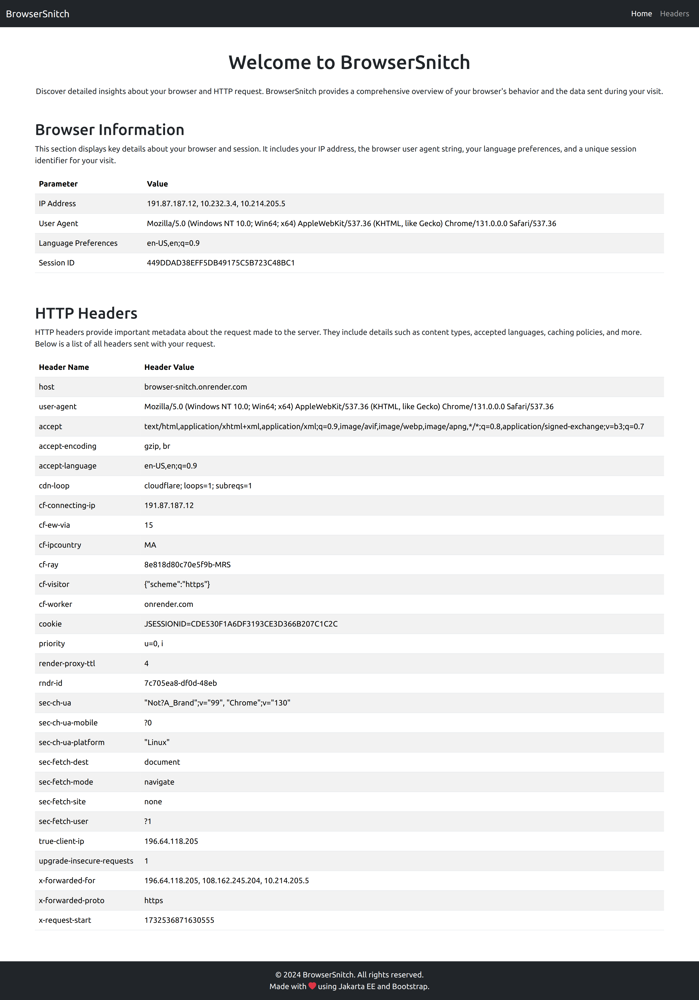
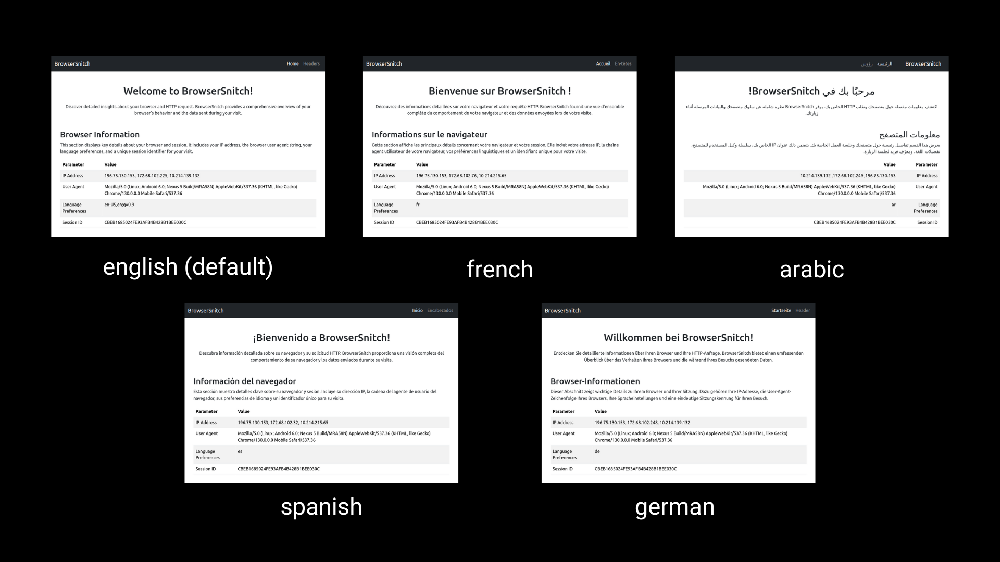

<a name="readme-top"></a>

<!-- PROJECT SHIELDS -->


<div align="center">
  <!-- Contributors -->
  <a href="https://github.com/el-amine-404/browserSnitch/graphs/contributors"></a>
  <!-- Forks -->
  <a href="https://github.com/el-amine-404/browserSnitch/network/members"></a>
  <!-- Stars -->
  <a href="https://github.com/el-amine-404/browserSnitch/stargazers"></a>
  <!-- issues -->
  <a href="https://github.com/el-amine-404/browserSnitch/issues"></a>
  <!-- license -->
  <a href="https://github.com/el-amine-404/browserSnitch/blob/master/LICENSE.txt"></a>
  <!-- linkedin -->
  <a href="linkedin.com/in/amine-el-houjjaji"></a>
</div>

<!-- PROJECT LOGO -->
<br />
<div align="center">
  <a href="https://github.com/el-amine-404/browserSnitch">
    
  </a>
  <h3 align="center">BrowserSnitch</h3>
    A Jakarta EE application that provides detailed insights about your browser and HTTP request
    <br />
    <!-- <a href="https://github.com/el-amine-404/browserSnitch"><strong>Explore the docs »</strong></a>
    <br /> -->
    <br />
    <a href="https://browser-snitch.onrender.com">View Live Demo</a>
    ·
    <a href="https://github.com/el-amine-404/browserSnitch/issues">Report Bug</a>
    ·
    <a href="https://github.com/el-amine-404/browserSnitch/issues">Request Feature</a>
  </p>
</div>

<!-- TABLE OF CONTENTS -->

<!-- ## 📜️ - Table of Contents (ToC) <a id="ToC"></a> -->

<details><summary>Table of Contents (ToC)</summary>

- [About The Project](#about-the-project)
    - [Built With](#built-with)
- [Usage](#usage)
- [Contributing](#contributing)
- [License](#license)

</details>


<!-- ABOUT THE PROJECT -->
## About The Project

<div align="center">
  
  <p><i>BrowserSnitch<br>(informations changed for privacy reasons ;D)</i></p>
</div>


**BrowserSnitch** is a web application designed to display detailed information about the browser and HTTP request sent by the client.

### **Features**
- **Browser Information**: Displays your IP address, user agent, session ID, and language preferences.
- **HTTP Headers**: Provides a detailed view of all HTTP headers sent in your request.
- **Modern Design**: Responsive and clean interface built with Bootstrap.
- **Docker Support**: Easily deploy using Docker containers.
- **Internationalization (i18n) Support**: The website detects the user's preferred language from the browser and applies it automatically. Right-to-Left (RTL) and Left-to-Right (LTR) layouts are automatically handled for better usability.


Currently, the website supports 5 languages:
- English  (default)
- Arabic
- French
- Spanish
- German

<div align="center">
  
  <p><i>BrowserSnitch<br>(supported languages)</i></p>
</div>


<p align="right">(<a href="#readme-top">back to top</a>)</p>

### Built With

This website is created using the following tech stack:

 **Dependency**  | **Version** | **Description**                                               |
|-----------------|-------------|---------------------------------------------------------------|
| `Servlet`       | `6.1.0`     | Jakarta Servlet API for handling HTTP requests and responses. |
| `JSP`           | `4.0.0`     | Jakarta JSP API for rendering dynamic HTML content.           |
| `JSTL`          | `3.0.0`     | JSTL API for JavaServer Pages for working with custom tags.   |
| `Maven`         | `3.9.6`     | Build automation and dependency management.                   |
| `Bootstrap`     | `5.3.3`     | Frontend framework for responsive UI.                         |
| `Docker`        | `27.3.1`    | Containerization for deployment.                              |
| `Apache Tomcat` | `11.0.1`     | Jakarta EE-compatible web container for deploy the WAR file.. |

<br>
<br>
<p align="center">
  <a href="https://skillicons.dev">
    
    <br>
    
    <br>
        
    <br>
    
  </a>
</p>

<p align="right">(<a href="#readme-top">back to top</a>)</p>

<!-- USAGE EXAMPLES -->
## Usage
          
### Requirements

For Requirements, you only need to have `docker` installed and configured on your system

You can either build the image locally or pull it from docker hub

### OPTION 1 - build local docker image

```bash
docker build -t browser-snitch .
```

run the container

```bash
docker run -it -p 8080:8080 browser-snitch 
```

The last command will expose the port 8080 on your host so open the browser and type the following url:
```txt
localhost:8080
```

### OPTION 2 - pull from docker hub

```bash
docker pull elamine404/browser-snitch:1.1
```

run the image

```bash
docker run -it -p 8080:8080 elamine404/browser-snitch:1.1 
```


<p align="right">(<a href="#readme-top">back to top</a>)</p>


<!-- CONTRIBUTING -->
## Contributing

BrowserSnitch is an open-source project and we welcome contributions from the community.

If you have a suggestion that would make this better, please fork the repo and create a pull request. You can also simply open an issue with the tag "enhancement". Don't forget to give the project a star! Thanks again!

- STEP - 1 - Fork the Project
- STEP - 2 - Create your Feature Branch
    ```sh
    git checkout -b feature/AmazingFeature
    ```
- STEP - 3 - Commit your Changes
    ```sh
    git commit -m 'Add some AmazingFeature'
    ```
- STEP - 4 - Push to the Branch
    ```sh
    git push origin feature/AmazingFeature
    ```
- STEP - 5 - Open a Pull Request

<p align="right">(<a href="#readme-top">back to top</a>)</p>


<!-- LICENSE -->
## License

available soon :D

<p align="right">(<a href="#readme-top">back to top</a>)</p>